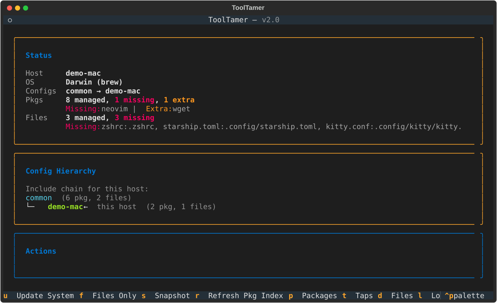
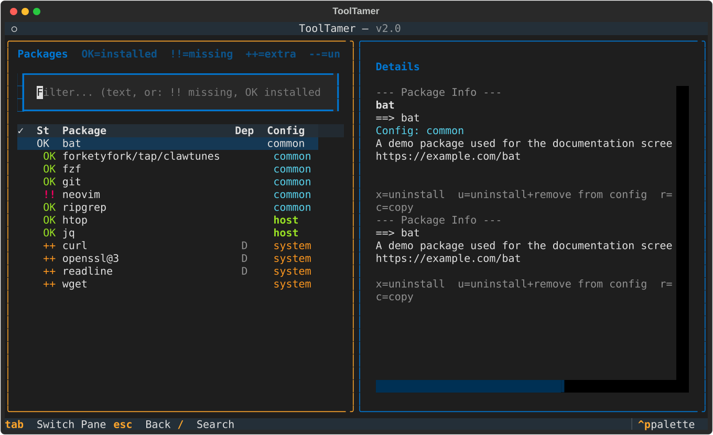
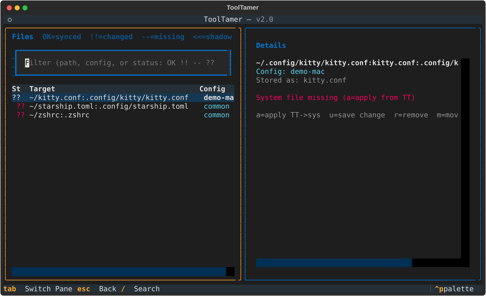

# Getting Started

## First Run

Start ToolTamer:

```bash
tt
```

On first run, you'll be asked for a **Git repository URL** for your configuration. You have two options:

- **Provide a URL** — ToolTamer clones it into `~/.config/toolTamer/`.
- **Press Enter** — ToolTamer creates a default structure locally in `~/.config/toolTamer/`.

If you create a fresh config, ToolTamer will offer to seed it with common config files (like `.zshrc`, `.bashrc`, etc.) based on what exists in your home directory.

## The Interface

With **Python 3.12+** available, `tt` opens a full-screen TUI (it sets up its
own virtualenv the first time, which takes a moment). The dashboard shows what
is out of sync on this machine, the config hierarchy in effect, and the
available actions:



From there you reach:

**Packages** — every package with its status: `OK` installed, `!!` missing,
`++` installed but in no config, `D` needed by something else. Install and
uninstall inline, move packages between configs, or mark several rows with
`Space` and act on all of them at once. Uninstalls are checked against the
real dependency graph first, so removing something another package needs is
refused rather than attempted.



**Files** — tracked files with a diff against what's actually on disk, and a
per-file choice of which version wins.



Everything below is also available from the command line — see
[Command line](#command-line).

## The Classic Menu

Without a suitable Python, `tt` falls back to the text menu (also reachable
via `tt --admin`):

```
-----> ToolTamer V1.0 - main menu
1. Update System - full system update, local files, installation, local install script
2. Files only - update only files
3. Snapshot System
4. Admin
5. Quit
```

### Update System

Applies your ToolTamer configuration to the current machine:

1. Installs packages listed in `to_install.brew` / `to_install.apt` / `to_install.pacman`
2. Removes packages that are installed but **not** in your config (dependencies are preserved)
3. Syncs configuration files from ToolTamer to your home directory
4. Runs `local_install.sh` scripts (if present)

### Files Only

Same as above, but skips package management — only syncs configuration files.

### Snapshot System

The reverse direction: captures your current system state into ToolTamer:

- Records all installed packages into the `to_install.*` file
- Copies current versions of configured files into ToolTamer

This is useful when you've set up a new machine manually and want to capture that state.

## Command line

Everything can be driven without the interactive interface:

```bash
tt                    # interactive TUI (classic menu as fallback)
tt --syncSys          # full sync: packages, files, local_install.sh
tt --syncFilesOnly    # only files
tt --updateToolTamer  # snapshot installed packages into the config
tt --admin            # admin menu
tt --fix-taps         # qualify third-party-tap package names
tt --cleanup-deps     # drop packages only listed because something depends on them
tt -h
```

`--fix-taps` and `--cleanup-deps` only report what they would do; add
`--apply` to change your config, which asks for confirmation first. Both pass
any further arguments through, so `tt --fix-taps --help` shows their own
options.

## Typical Workflow

1. **Set up your first machine:**
    - Install ToolTamer
    - Run `tt`, let it create a default config
    - Customize your package list and add config files
    - Use "Snapshot System" to capture your setup

2. **Push your config:**
    - Open Admin → Git view (lazygit) to commit and push

3. **Set up another machine:**
    - Install ToolTamer
    - Run `tt`, provide your Git repo URL
    - Use "Update System" to apply the config

4. **Ongoing sync:**
    - Make changes on any machine
    - Snapshot → commit → push
    - Pull → Update System on other machines
